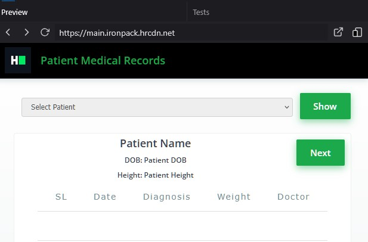

# Patient Medical Records

> Has been told that this is the hardest challenge thus practicing it the last

| Heading |
| ----------- |
| [see live version on vercel](https://hackerrank-react-medical-records.vercel.app/)|
|[code repo AT](https://github.com/attila5287/hackerrank-react-medical-records) |
|[solution1: only dropdown](./solution1.md) |
|[solution2: dropdown+  table](./solution2.md) |
|[solution3: next-prev buttons](./solution3.md) |
|[solution4: buttons + table (deployed)](./solution4.md) |

In this challenge, you will create a React application called "Patient Medical Records" that allows users to view and cycle through patients' medical records. The application requirements are outlined below, and your finished implementation must pass all provided unit tests.

# Detailed Requirements

    The application consists of two components: Search and Records.
        Search: Contains a dropdown select menu and a "Show" button.
        Records: Displays the selected patient's records in a table and includes a "Next" button to navigate to the next patient's records.
    The Search component must have a dropdown select menu populated with 3 patient names from a file named medicalRecords.js. By default, the dropdown should display "Select Patient" with both selected and disabled attributes.
    When the application is first loaded, no record table or "Next" button should be visible.
    Show Button Functionality:
        If the user clicks "Show" without selecting a patient, an alert should appear with the message: "Please select a patient name".
        If a patient is selected, clicking "Show" should display a table containing all of the selected patient’s details and medical records. The table must also include a "Next" button to navigate through records.
    Next Button Functionality:
        Clicking "Next" should display the medical records for the next patient in the list based on their ID.
        If the last patient's records are being displayed, clicking "Next" should loop back to the first patient's records.

Sample Interaction

Initial State

    The select menu displays "Select Patient".
    No records or "Next" button is visible.

User Action 1

    The user selects a patient from the dropdown menu and clicks "Show"
    The patient's details and records appear in a table along with a "Next" button.

User Action 2

    The user clicks "Next" to view the next patient's records.
    The table updates with the next patient's details.

User Action 3

    If the user is on the last patient and clicks "Next", the records cycle back to the first patient
